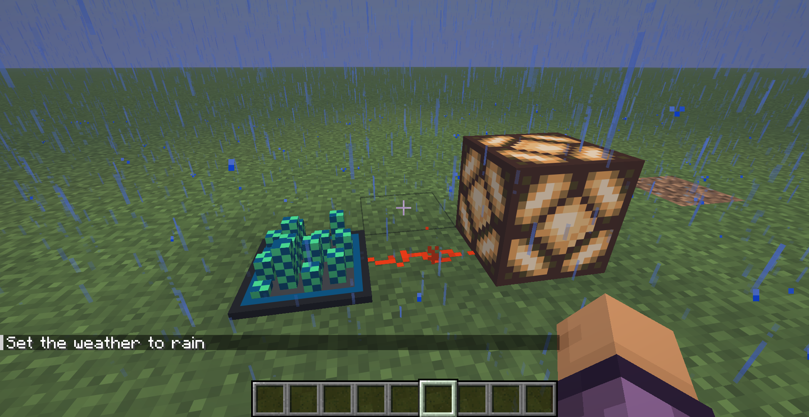
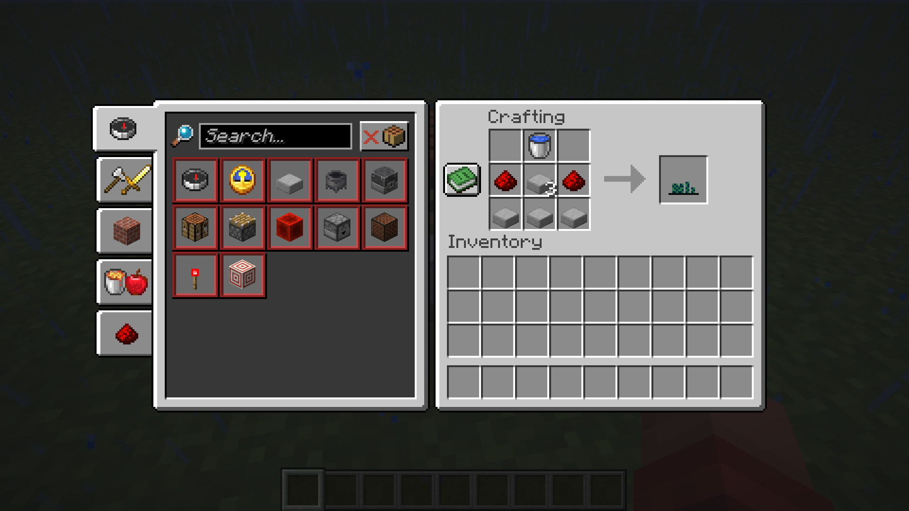

# SensiCraft

A Minecraft mod that adds sensors to your world.

SensiCraft is built around simple sensors that can detect things happening around you and give you a way to use that information in your builds.

## Features

### Rain Sensor

The Rain Sensor detects when it is raining and gives you a simple way to react to the weather in-game.

* Detects rain
* Can be crafted and placed in the world
* Designed to work as part of redstone builds

### Crafting

The Rain Sensor has its own crafting recipe.

## Roadmap

* [x] Rain Sensor
* [ ] Mob Sensor
* [ ] More sensors

## Development

SensiCraft is still in development. New sensors and features will be added as the mod grows.

## License

SensiCraft is licensed under the MIT License.
