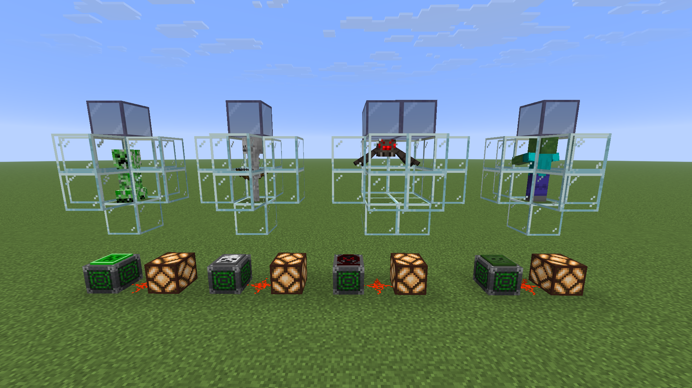
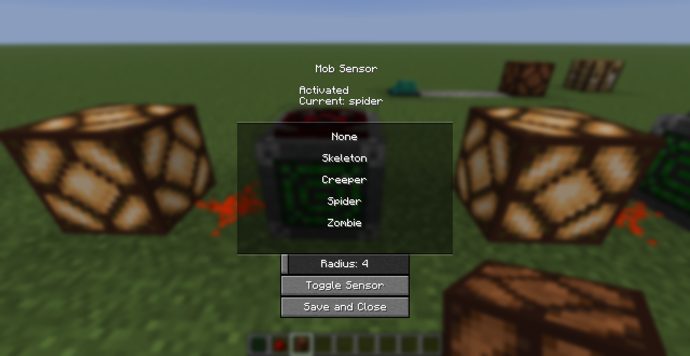
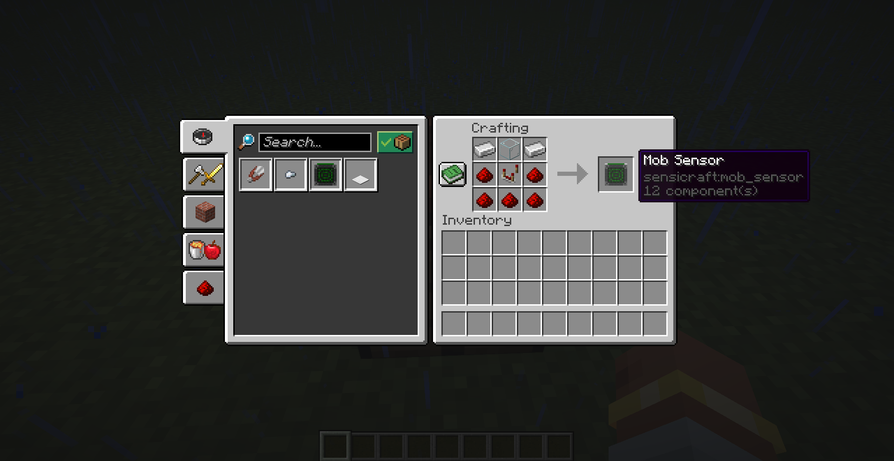

# SensiCraft

**A Minecraft mod that adds configurable sensors for redstone builds and automation.**

SensiCraft lets you detect things happening in your Minecraft world and turn them into useful redstone signals.

## Features

### Mob Sensor

The Mob Sensor detects specific mobs within an **8-block radius** and outputs a redstone signal when the selected mob is nearby.

- Detects **Creepers, Skeletons, Zombies, and Spiders**
- Select the mob to detect through an in-game GUI
- Toggle the sensor on and off
- Outputs a redstone signal when the selected mob is detected
- Continuously checks for mobs entering and leaving its detection range
- Fully persistent across world reloads

### Rain Sensor

The Rain Sensor detects when it is raining and can be used as part of redstone builds and automated systems.

- Detects rain
- Outputs a redstone signal
- Can be crafted and used in survival

## Crafting

### Mob Sensor

The Mob Sensor is designed to be a more advanced redstone component, requiring a comparator, redstone, iron, and glass.

### Rain Sensor

## Development

SensiCraft is actively being developed. The goal is to add more useful sensors while keeping them simple to use and fun to build with.

## License

SensiCraft is licensed under the MIT License.
