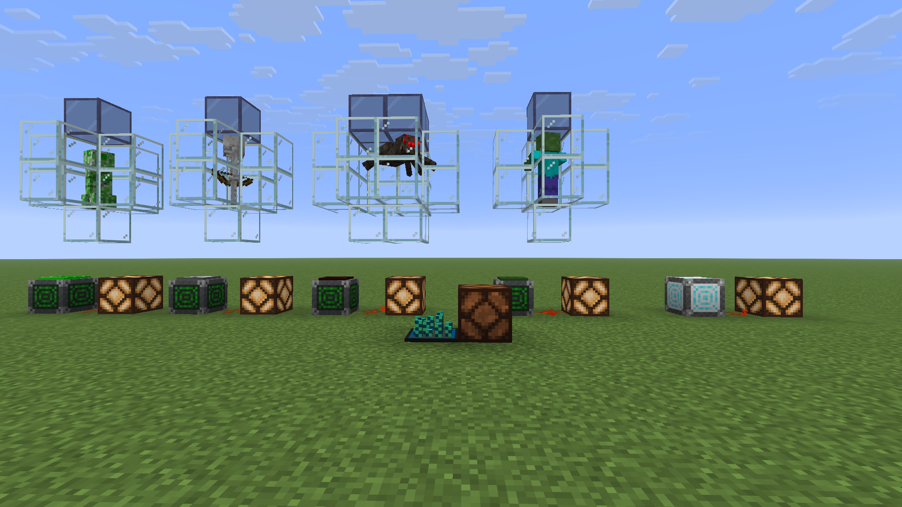
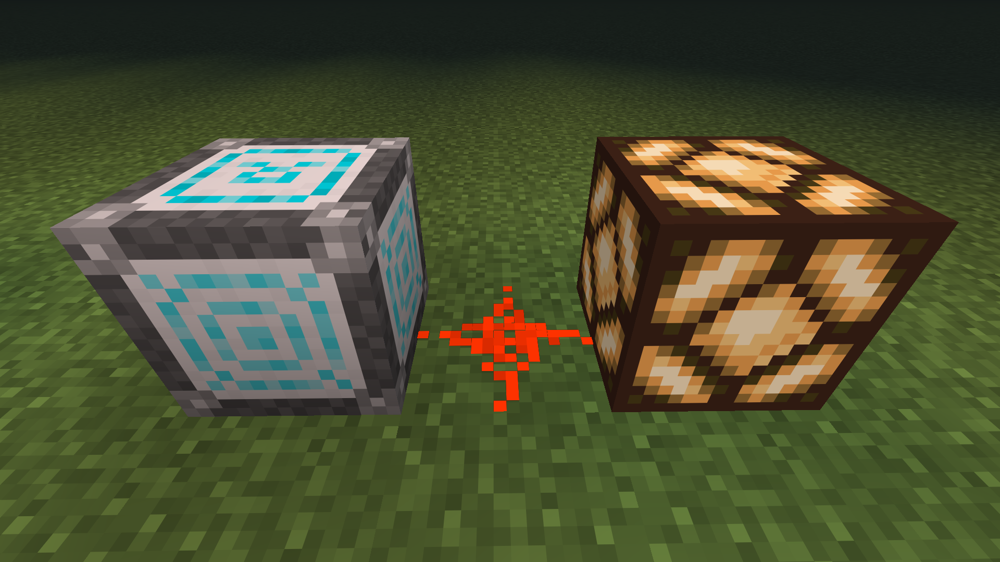
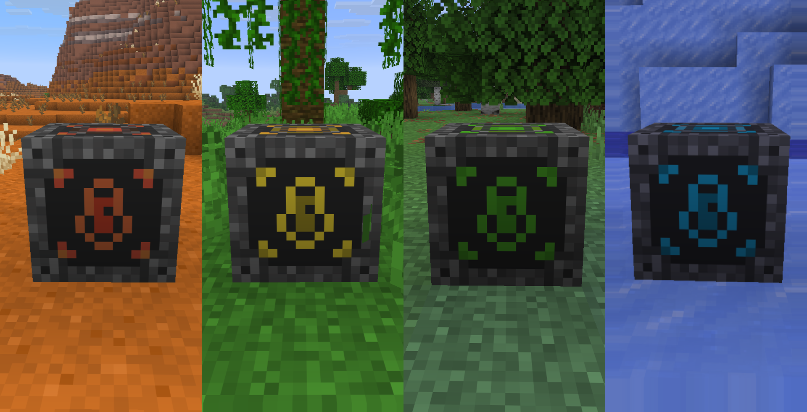
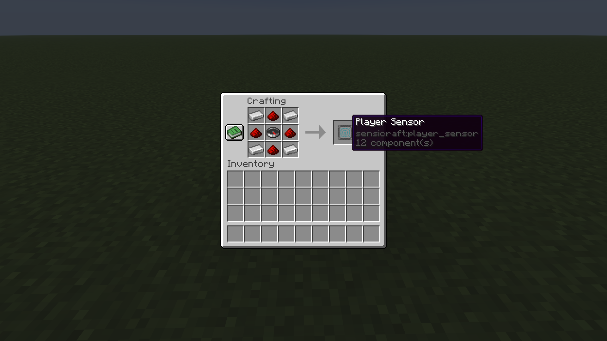
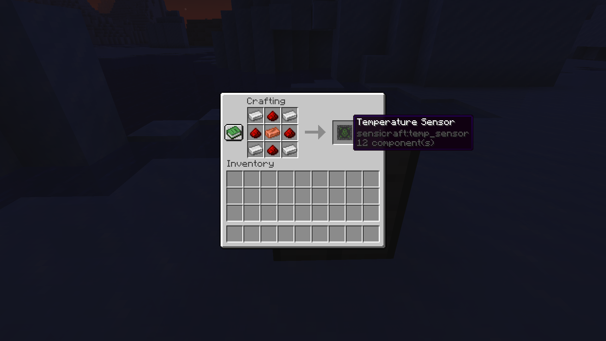

# SensiCraft

**A Minecraft mod that adds configurable sensors for redstone builds and automation.**

SensiCraft lets you detect things happening in your Minecraft world and turn them into useful redstone signals.

> **SensiCraft is currently in Alpha.** Features, recipes, and mechanics may change as development continues.

## Features

### Player Sensor

The Player Sensor detects nearby players and outputs a redstone signal when a player is detected.

- Detects nearby players
- Outputs a redstone signal when a player is detected
- Can be crafted and used in survival
- Designed for redstone builds and automation

### Mob Sensor

The Mob Sensor detects specific mobs within its configurable detection radius and outputs a redstone signal when the selected mob is nearby.

- Detects **Creepers, Skeletons, Zombies, and Spiders**
- Select the mob to detect through an in-game GUI
- Configure the detection radius
- Toggle the sensor on and off
- Outputs a redstone signal when the selected mob is detected
- Continuously checks for mobs entering and leaving its detection range
- Fully persistent across world reloads

### Rain Sensor

The Rain Sensor detects when it is raining and can be used as part of redstone builds and automated systems.

- Detects rain
- Outputs a redstone signal while it is raining
- Can be crafted and used in survival

### Temperature Sensor

The Temperature Sensor detects the temperature of its surroundings and outputs a redstone signal based on the configured temperature threshold.

- Detects temperatures from **-15°C to 40°C**
- Configure a temperature threshold
- Outputs a redstone signal when the measured temperature reaches the threshold
- Continuously measures the surrounding temperature
- Can be crafted and used in survival

## Crafting

### Player Sensor

### Mob Sensor

### Rain Sensor

### Temperature Sensor

## Development

SensiCraft is actively being developed. The goal is to add more useful sensors while keeping them simple to use and fun to build with.

For the beta, **1 more sensor** is left, this one with variable redstone output based on entity distance.
And in the first actual release, every sensor will have the option to output variable redstone.

### Current Sensors

- **Rain Sensor**
- **Mob Sensor**
- **Player Sensor**
- **Temperature Sensor**

More sensors are planned for future updates.

## Current Version

SensiCraft is currently in **Alpha**. v1.0.0-alpha

During this stage, features and mechanics may change as the mod continues to develop. Bugs and unfinished features are expected.

If you find a bug or have a suggestion for a new sensor, feel free to open an issue on the GitHub repository.